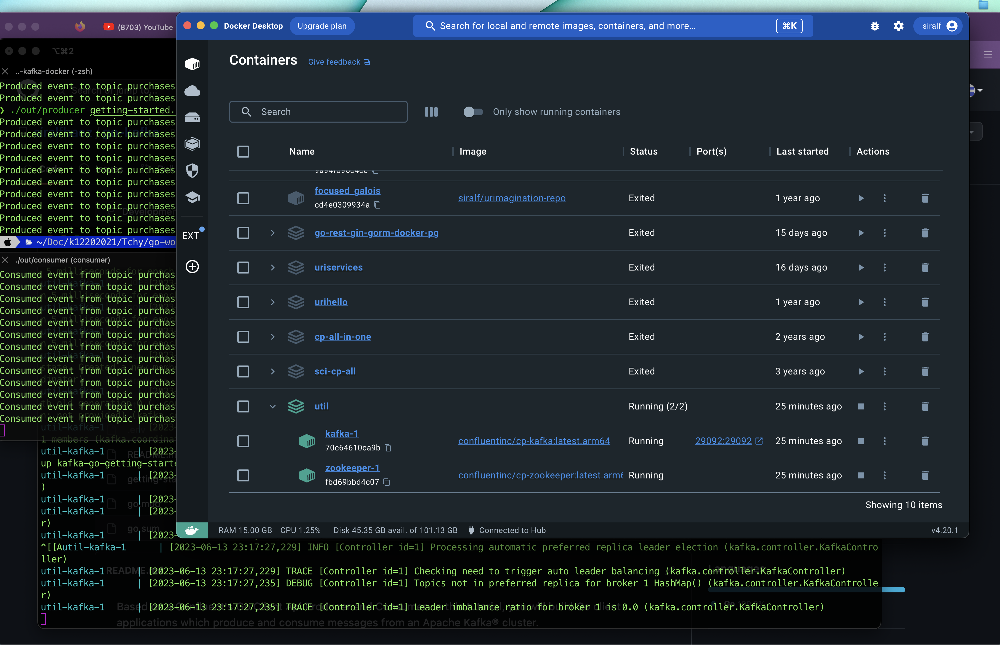
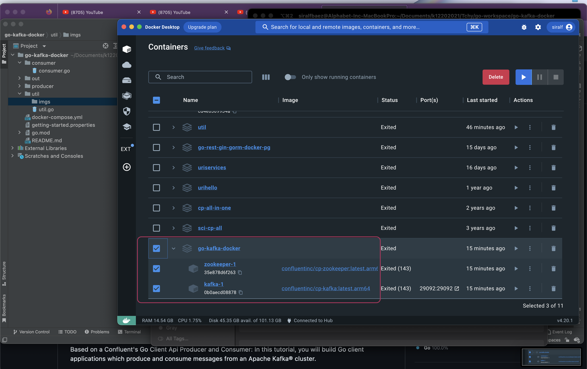

Modified for on Premises used. Based on

https://developer.confluent.io/get-started/go/#introduction
In this tutorial, you will build Go client 
applications which produce and consume messages 
from an Apache Kafka® cluster.

As you're learning how to run your first Kafka 
application, we recommend using Confluent Cloud 
(no credit card required to sign up) so you 
don't have to run your own Kafka cluster 
and you can focus on the client development. 
But if you prefer to setup a local Kafka cluster, 
the tutorial will walk you through those steps.
Introduction


please check below url for all os

https://go.dev/doc/install

First run:

```
go build -o out/producer util.go producer.go
```

Then:
```
go build -o out/consumer util.go consuer.go

```

Run this command each terminal
```
./out/producer getting-started.properties

```


Run it again:
```
./out/consumer getting-started.properties

```

The image is renamed to something more suitable.



Reference:
https://developer.confluent.io/get-started/go/#introduction

